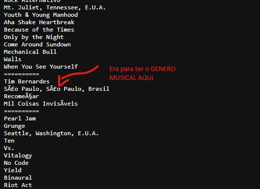

# Como executar:

## Para compilar:

`gcc main.c filesystem.c .\operations.c .\sort.c .\utils.c .\search.c -o output.exe`

## Para executar:

`./output.exe`

## OBS 1:

Achei um erro no arquivo de dados:

Adicionei o genero Rock Alternativo para contornar o problema.

## OBS 2:

No Powershell, executar o seguinte codigo para resolver problema dos acentos:

`$OutputEncoding = [console]::InputEncoding = [console]::OutputEncoding =
New-Object System.Text.UTF8Encoding`

No CMD, executar o seguinte codigo para resolver problema dos acentos:

`chcp 65001`
